# BMW-M2-DCT-Gear-indicator
OBD2 / CAN bus to display current gear in a BMW M2 with DCT  
  
The clear uncluttered display can show either current DCT gear, speed, water or oil temperatures. I use speed when daily driving, current gear when driving back roads and temperatures when I'm on track. Thanks to the big digits and uncluttered display I always see the number even when looking straight ahead and not at the display at all.  
  
The basis is that the unit gets OBD2 data from the car, calculates what gear you're in by matching rpm and speed and then sends this as fake OBD speed data to an OBD HUD display. So when you're in third gear it sends "speed" as "3" to the display, which is set to show speed. So it shows "3". Same thing with oil and water temperatures, they're all sent as "speed". 
  
Any OBD HUD display should theoretically work. You can also use other displays, LED 7 segment for example with some simle tweaking of the code of course. I did some test units with a mirror and inverted LED 7 segment displays to simulate a built in HUD display but it was simly to bulky to place on top of the dashboard.  
  
I place my computing unit behind the instrument cluster connecting it to the CAN bus inside the cluster (and picking up switched 12V for power there too) but the easiest way is of course simply connecting it to the car's OBD2 jack.
    
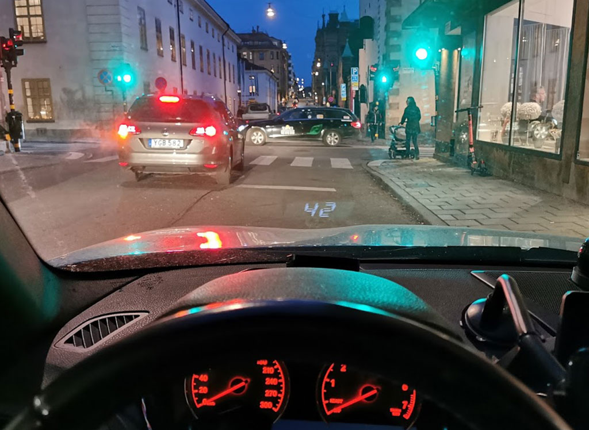  
  
  
  
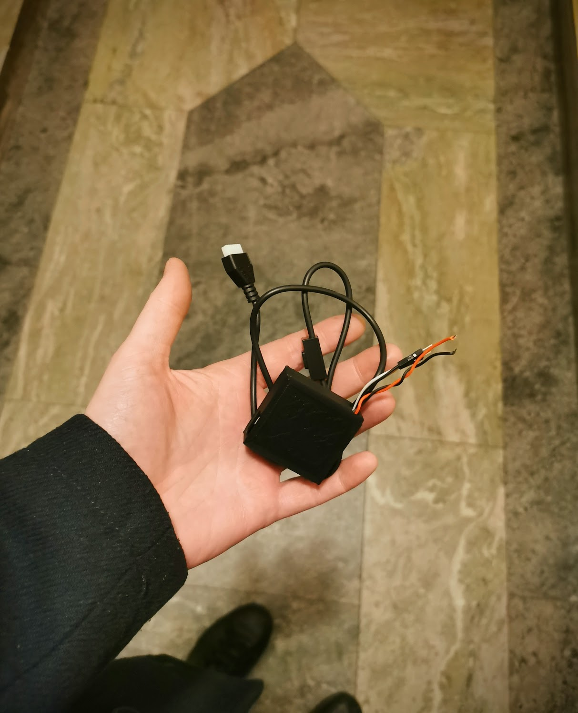  
  
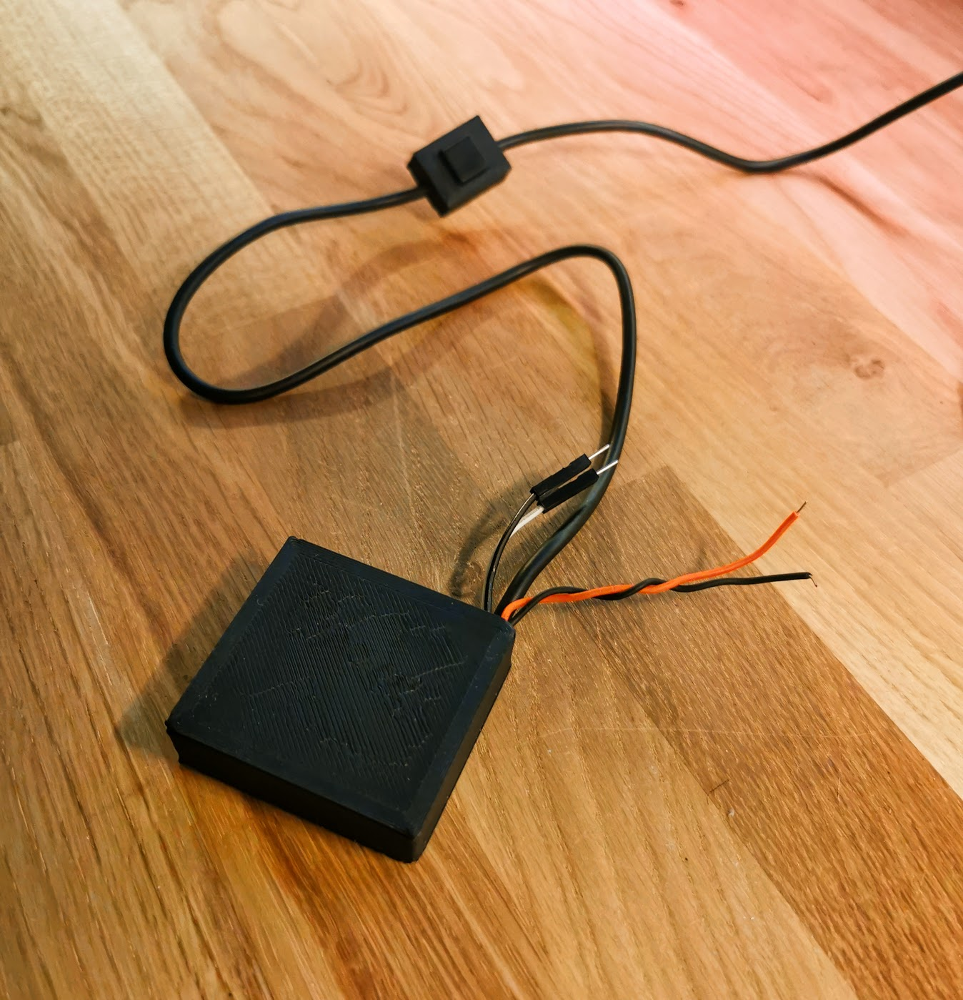  
  
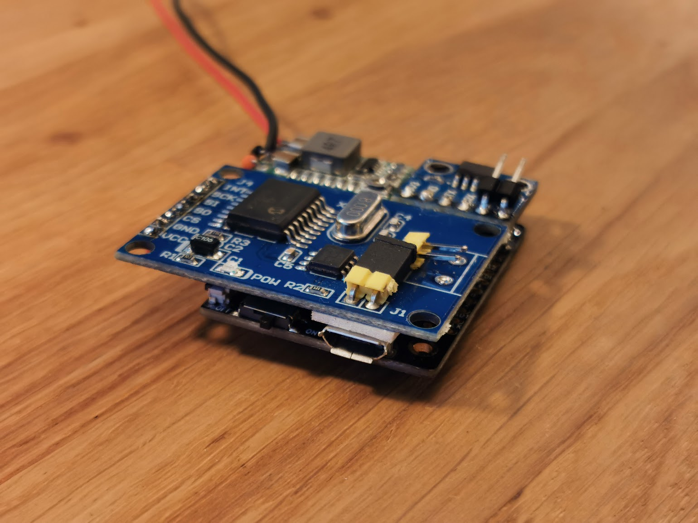  
  
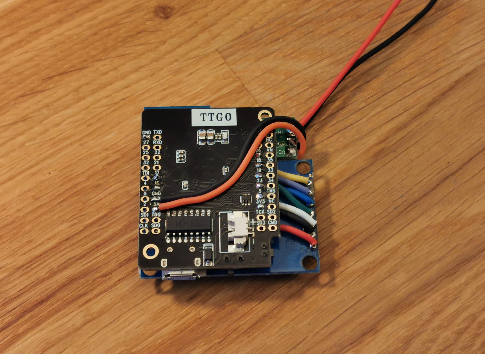  
  
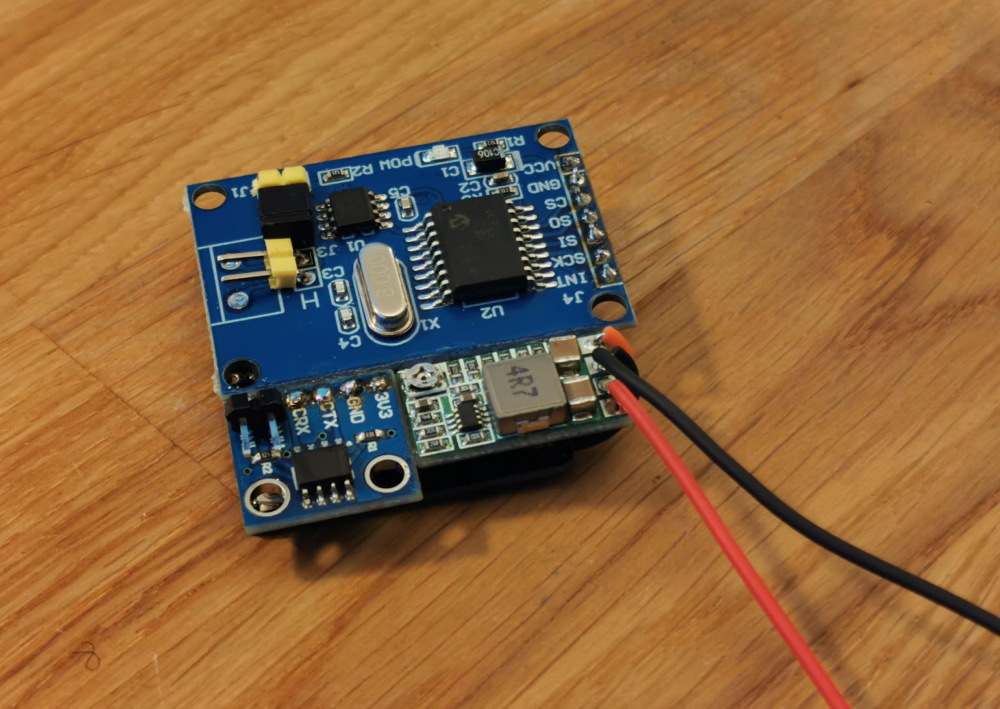  
  
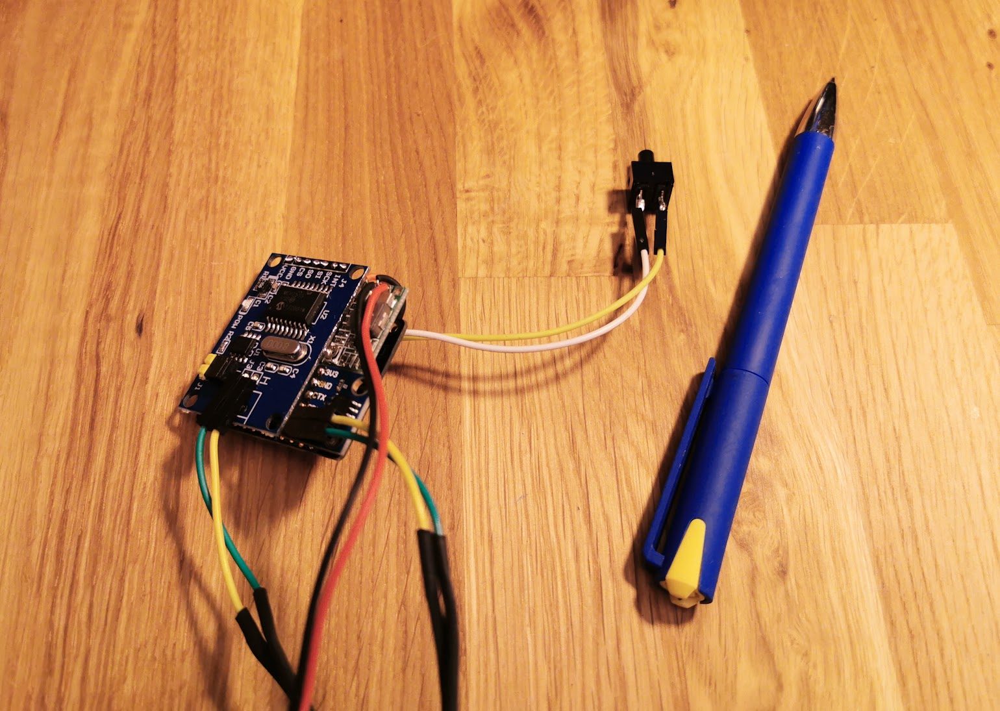  
  
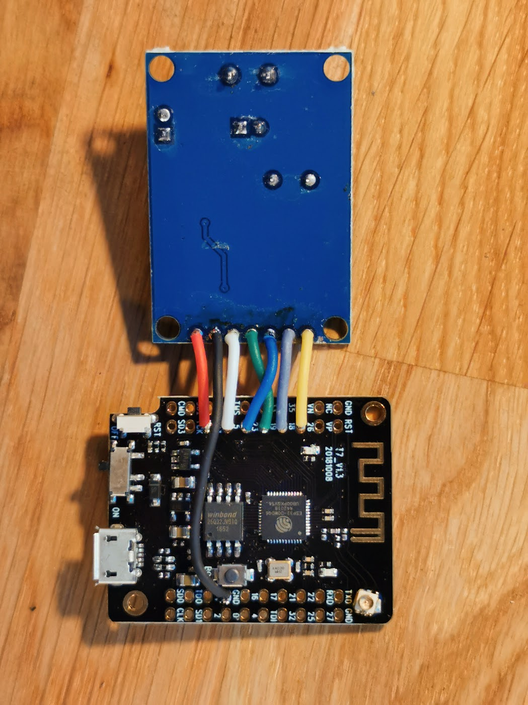  
  

# Parts:  
  
MINI32 (other ESP32 variants work too of course)  
https://www.aliexpress.com/w/wholesale-t7+esp32+mini.html  
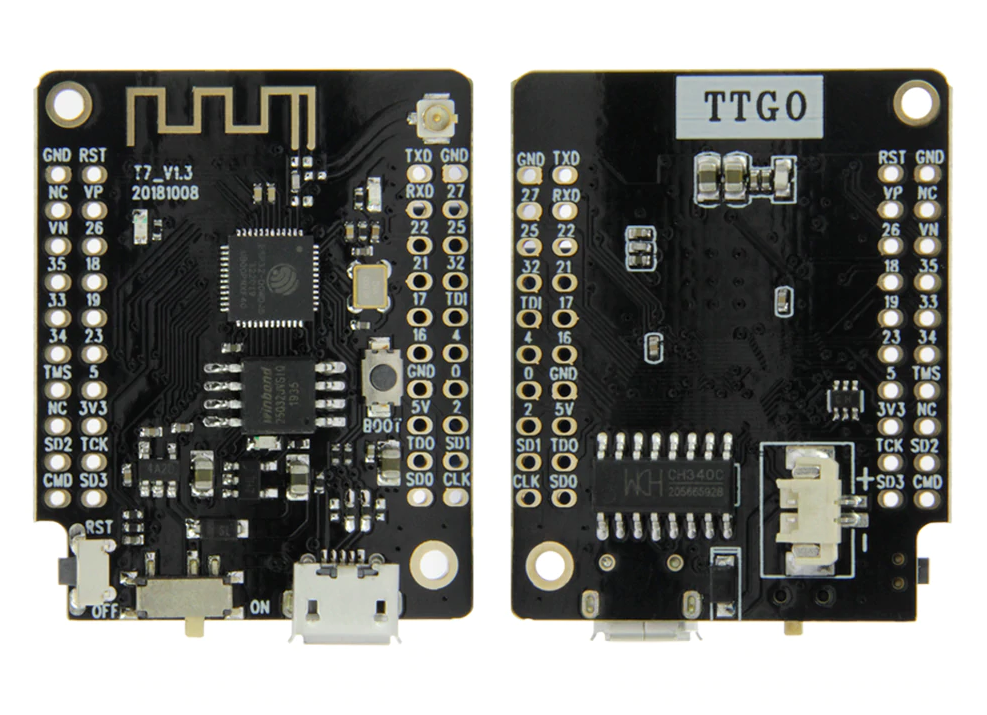

MCP2515  
https://www.aliexpress.com/w/wholesale-mcp2515.html  
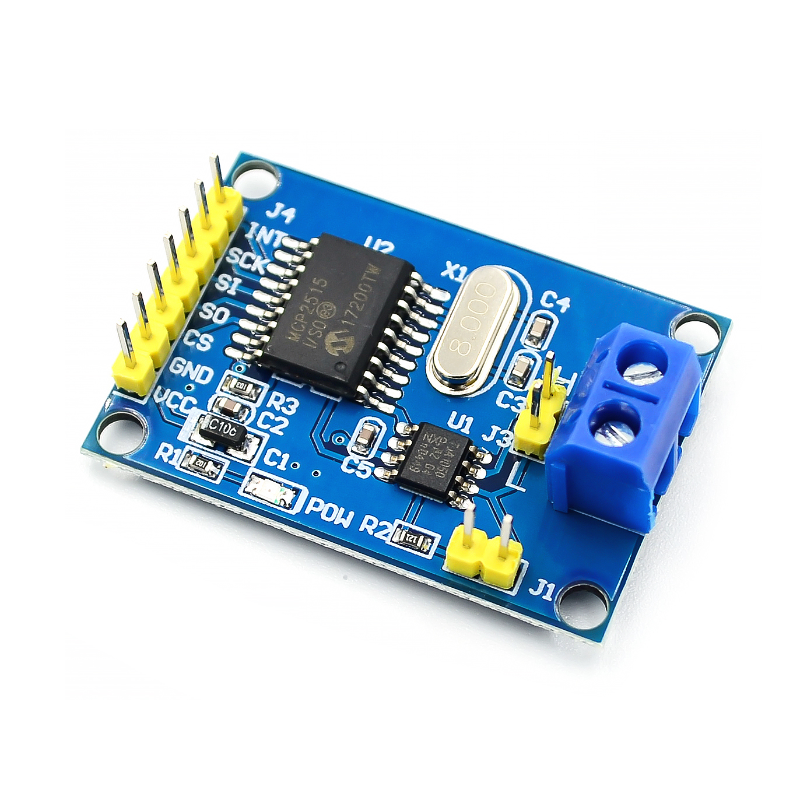
  
SN65HVD230 CAN transceiver (a TJA1050 will work fine too)  
https://www.aliexpress.com/w/wholesale-sn65hvd230.html  
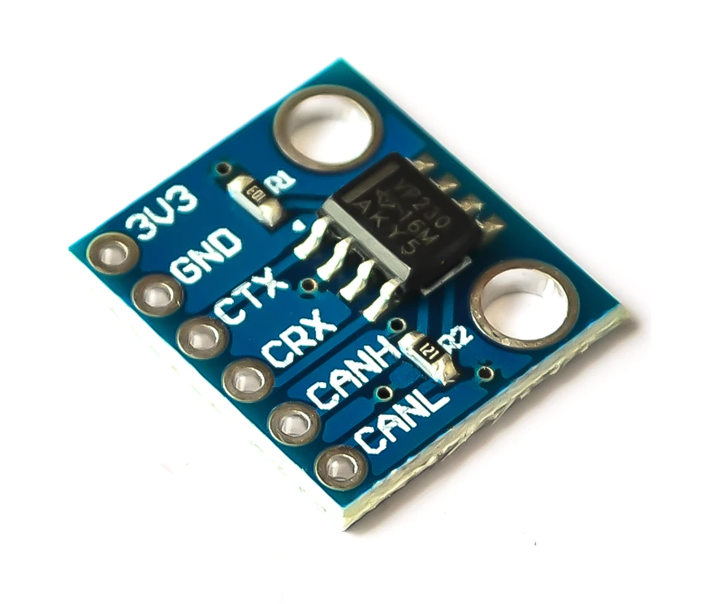
  
OBD2 display (I choose this for its clean uncluttered display and large digits)  
https://www.ebay.co.uk/itm/143478383828   
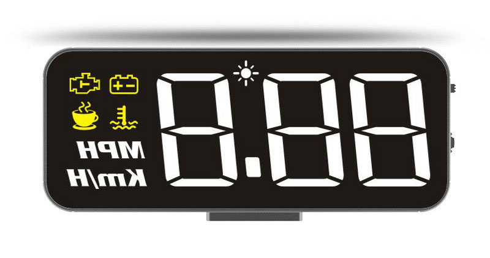
  
DC-DC converter  
https://www.aliexpress.com/wholesale?SearchText=dc-dc+1.8V+2.5V+3.3V+5V+9V+12V   
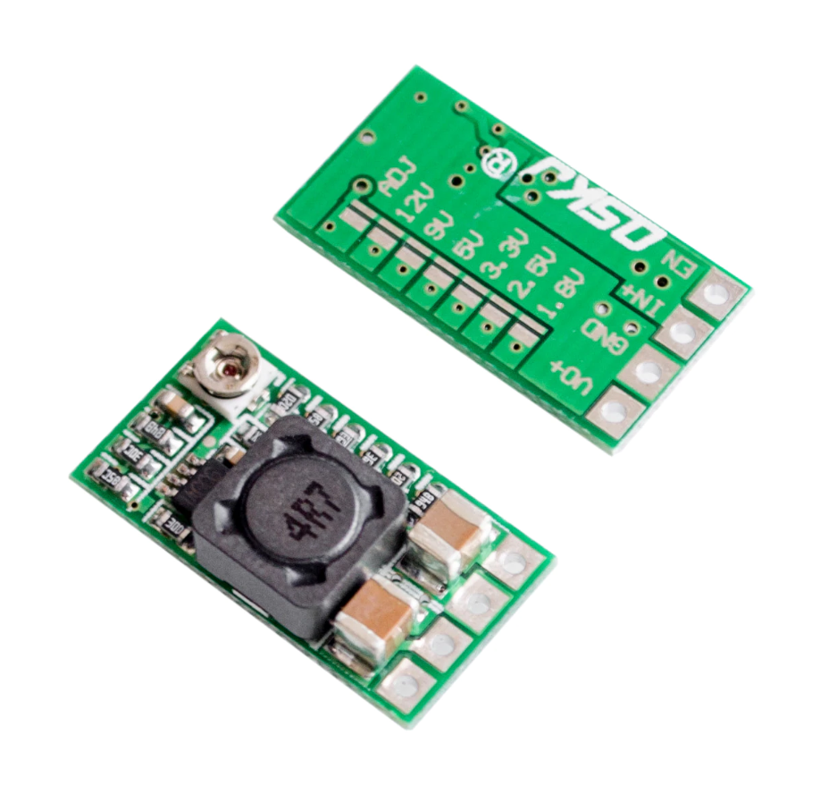  
  
And a push switch to change between speed, current gear, water and oil temps. This _might_ get obsolete if I get around to switching display modes using one of the cars steering wheel buttons instead (long press on "res")  
  
 
  
   
# Tips:  
  
1.
Make sure the display isn't scaling the incoming data, many can show 100kmh as 102, 102 and so on by a scaling setting in their settings menu. Just set 100 to show 100.

2.
Preferably you power the ESP32 and display with power that turns off when the car is off. But if you only have constant power you can make the DC-DC converter shutdown when the voltage drops under 13V which it does when the engine isn't running and is charging the car battery. Connect a zener diode from the incoming "12V" from the car to the DC-DC enable ("EN") pin with the zener cathode towards the incoming 12V and the anode towards the DC-DC board. Then connect a 10Kohm resistor between the enable pin and gorund. Double check that it actually does power off properly in your car. I doubt you'll need it but worst case you need a slightly higher or lower voltage on the zener, or a voltage divider with one extra resistor to adjust the control voltage to the enable pin. This trick will only power off the ESP32, make sure your OBD display auto shuts off too, they normally have some settings for that.  
  
If you hook up directly to the CAN bus in the instrument cluster you must do this zener shutdown trick since the processor sends out CAN requests for speed and so on as long as it is powered on and this keeps the instrument cluster alive.    

3.
Don't forget to set the DC-DC converter output to 5 volts!  
    
  
# Install libraries:

- https://github.com/collin80/esp32_can
- https://github.com/collin80/can_common
       
NOTE: YOU MUST ACTIVATE MCP2515 AND DEACTIVATE MCP2517 IN TWO FILES IN THE ABOVE LIBRARY LIKE THIS:  
  
In library\esp32_can\src\esp32_can.cpp  
``` 
    //MCP2517FD CAN1(5, 27);   
    MCP2515 CAN1(5, 27);  
``` 
      
In library\esp32_can\src\esp32_can.h  
``` 
    //extern MCP2517FD CAN1;  
    extern MCP2515 CAN1;  
``` 

# Connect:

``` 
ESP32     MCP2515  
  
GPIO5     CS  
GPIO23    SI  
GPIO19    SO  
GPIO18    SCK  
GPIO26    INT  
5V        VCC  
GND       GND  
and the MCP2515's two CAN bus pins connected the CAN pins on an OBD2 HUD display	
```  

```  
ESP32     SN65HVD230
  
GPIO16    CRX  
GPIO17    CTX  
3V3       3V3  
GND       GND  
and the SN65HVD230's two CAN bus pins connected to the cars OBD2 CAN pins  
```  
  
```  
ESP32     PUSH SWITCH
  
GPIO32    a  
GND       b  
```  

