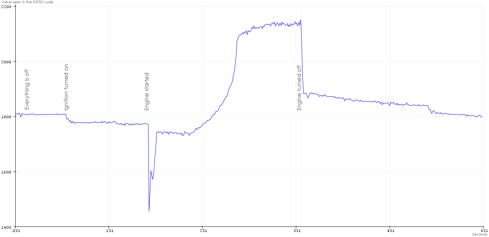

# BMW-M2-DCT-Gear-indicator
OBD2 / CAN bus to display current gear in a BMW M2 with DCT  
  
The basis is that this kit gets OBD2 data from the car, calculates what gear you're in by matching rpm and speed and then sends this on as fake OBD "speed" data to any OBD head up display (HUD). So when you're in third gear the board sends "speed" as "3" to the display, which is set to show speed. So it shows "3". Same thing with oil and water temperatures, they're all sent as "speed".  
  
I actually only use it to display speed when daily driving, but set it to show current gear when driving back roads and temperatures when I'm on track. Thanks to the big digits and uncluttered display I always see the number even when looking straight ahead and not at the display at all. 
  
Any OBD HUD display should theoretically work. You can also use other displays, regular LED 7-segment displays for example, with some simple tweaking of the code of course. I did some test units with a mirror and also inverted LED 7-segment displays to simulate a built in HUD display but it was simply to bulky to place on top of the dashboard.  
  
I place these boards behind the instrument cluster connecting it to the CAN bus inside the cluster (and picking up switched 12V for power there too) but the easiest way is of course simply connecting it to the car's OBD2 jack.  
  
The total cost of parts excluding the OBD display itself is less than $10. The display I use is roughly an additional $20.
    
  
  
  
  
  
  
  
  
  
  
  
  
  
  
  
  
  
  

# Parts:  
  
MINI32 (other ESP32 variants work too of course)  
https://www.aliexpress.com/w/wholesale-t7+esp32+mini.html  


MCP2515  
https://www.aliexpress.com/w/wholesale-mcp2515.html  

  
SN65HVD230 CAN transceiver (a TJA1050 will work fine too)  
https://www.aliexpress.com/w/wholesale-sn65hvd230.html  

  
OBD2 display (I choose this for its clean uncluttered display and large digits)  
https://www.ebay.co.uk/itm/143478383828  
https://www.aliexpress.com/item/32849771008.html  
https://www.aliexpress.com/item/32848004639.html  


  
DC-DC converter  
https://www.aliexpress.com/wholesale?SearchText=dc-dc+1.8V+2.5V+3.3V+5V+9V+12V   
  
  
And a push switch to change between speed, current gear, water and oil temps. This _might_ get obsolete if I get around to switching display modes using one of the cars steering wheel buttons instead (long or double click on "res")  
  
 
  
   
# Tips:  
  
1.
Make sure the display isn't scaling the incoming data, many can show 100kmh as 102, 102 and so on by a scaling setting in their settings menu. Just set 100 to show 100. Otherwise it'll not show the correct gear.

2.  
To show mph instead of kmh enable this with the define in the source code. Then set the OBD HUD display __to show kmh__. 
  
3.
Don't forget to set the DC-DC converter output to 5 volts!  
  
4.  
Enable the 120 Ohm load resistor on the MCP2515 board by having the jumper for this put in place.  
  
  
# Install libraries:

- https://github.com/collin80/esp32_can
- https://github.com/collin80/can_common
       
NOTE: YOU MUST ACTIVATE MCP2515 AND DEACTIVATE MCP2517 IN TWO FILES IN THE ABOVE LIBRARY LIKE THIS:  
  
In library\esp32_can\src\esp32_can.cpp  
``` 
    //MCP2517FD CAN1(5, 27);   
    MCP2515 CAN1(5, 27);  
``` 
      
In library\esp32_can\src\esp32_can.h  
``` 
    //extern MCP2517FD CAN1;  
    extern MCP2515 CAN1;  
``` 

# Connect:

``` 
ESP32     MCP2515  
-----     -------  
GPIO5     CS  
GPIO23    SI  
GPIO19    SO      (don't connect GPIO19 and SO directly together but via a 1 KOhm resistor)  
GPIO18    SCK  
GPIO26    INT  
5V        VCC  
GND       GND  
and the MCP2515's two CAN bus pins connected the OBD2 HUD display's CAN pins 	
```  

```  
ESP32     SN65HVD230
-----     ----------  
GPIO16    CRX  
GPIO17    CTX  
3V3       3V3  
GND       GND  
and the SN65HVD230's two CAN bus pins connected to the cars OBD2 CAN pins  
```  
  
```  
ESP32     PUSH SWITCH
-----     -----------  
GPIO32    a  
GND       b  
```  
  
```  
ESP32     INCOMING 12V SENSE
-----     ------------------  
GPIO12    10 Kohm between GPIO12 and incoming 12V
          1 Kohm beween GPIO12 and GND
GND         
```  
  
  
# Auto Shutdown  
  
Preferably you power the ESP32 and the display with power that turns off when the car is off. But if you only have access to constant power you can make the DC-DC converter shutdown when the voltage from the car drops under 13V which it does when the engine isn't running and the battery isn't charging anymore.  
  
Using an 11 volt zener diode plus two resistors you can make the DC-DC converter shutdown the power to the ESP32 when the car isn't charging the car battery. You connect the three components as below to the DC-DC _enable_ pin ("EN"). 
  
Double check that the ESP32 actually does power off properly in your car. If it tends to not turn __off__ you can increase the value of the 4K7 resistor. And vice versa, if it tends to not turn __on__ you can decrease the value of the 4K7 resistor.
  
Note that this will not shutdown the display you are using, only the ESP32, since the display takes its power directly from the car and not via the DC-DC converter. But most HUD displays have a built in shutdown. The HUD in the parts list above even has a menu where you can choose at what voltage it should start and shut down.  

  
  
# Stop requesting data from the car
  
To stop requesting data from the car over OBD2/CAN, which can keep things like the instrument cluster alive if you connect to the CAN bus there, the ESP32 also watches the power voltage coming from the car using an analog input and two resistors. When the voltage drops below a certain level the code stops sending OBD2/CAN requests. The threshold value in the code is as default set to 1900, which equals roughly 12,5 volts.
  
  
